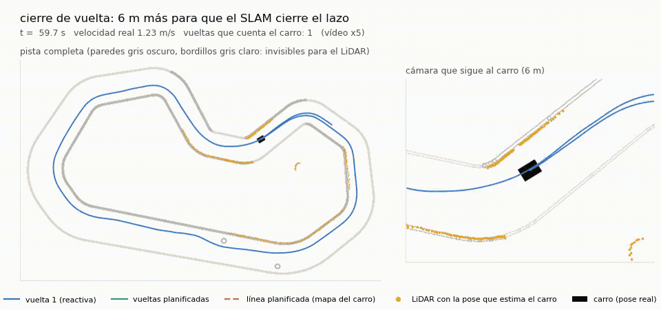
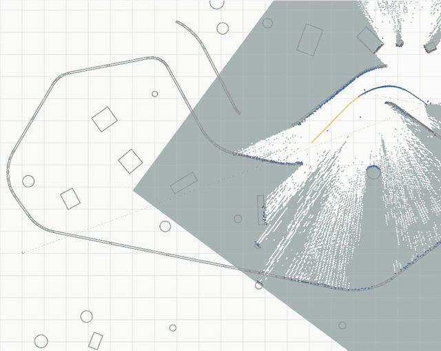
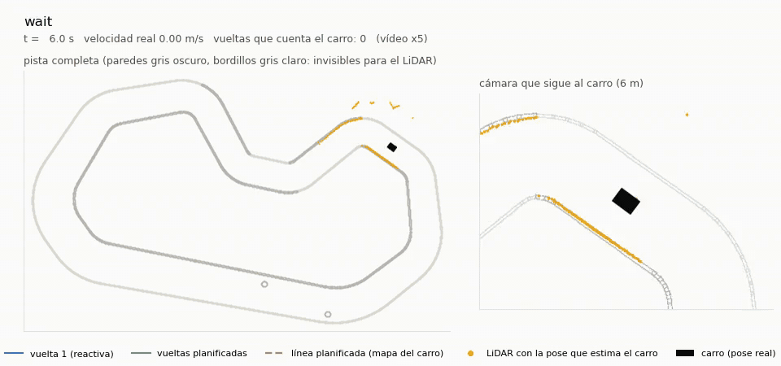
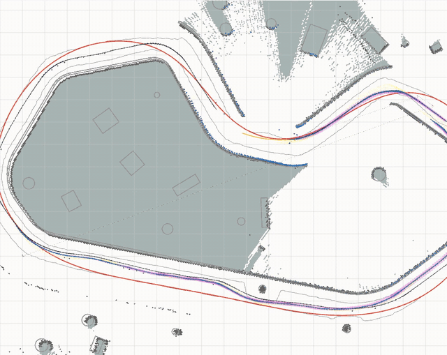
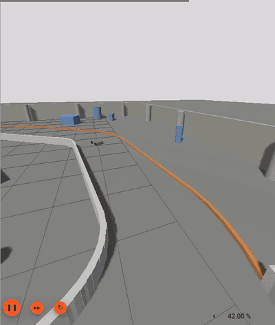

# Deep Drive APEX

Deep Drive APEX is an autonomous RC car project built with ROS 2 and Gazebo. The repository explicitly separates simulation, the SLAM-enabled physical vehicle, and historical code so each environment can evolve without mixing dependencies or commands.

## Autonomous Racing on a Track It Has Never Seen (Simulation)

<p align="center">
  
</p>

In Gazebo, on a track and with sensor draws never seen in training, the car:

- **Lap 1 (no map):** drives reactively on the LiDAR, following the walls, while `slam_toolbox` builds the map.
- **Closes its own lap:** it detects the crossing of its own start line.
- **Plans a racing line on its own map:** a minimum-curvature line in 0.5 s.
- **Races it:** laps 2 and 3 take about 22 s, against about 48 s for lap 1.

Its only pose is the neural LiDAR-inertial odometry corrected by the SLAM, and it uses only noisy sensors. It knows nothing about the track: it cannot see the curbs, which sit below the LiDAR plane.

| Lap 1: the map grows as the car explores (RViz) | Lap 1 from the logs: LiDAR placed with the car's own pose estimate |
| --- | --- |
|  |  |
| **Laps 2-3 on the planned line (RViz)** | **The car in Gazebo, followed by a camera** |
|  |  |

The full description is in [Real2sim race mode](simulation/ros2_ws/src/apex_fusion_research/README.md#131-race-mode-explore-map-race): validation on 4 seeds, the odometry model's training figures, and what worked.

## Documentation at a Glance

The documentation covers installation, quick starts, ROS architecture, Gazebo simulation, SLAM-enabled real-vehicle execution, interfaces, parameters, data, diagnostics, and legacy code.

## Start Here

| Goal | Recommended page |
| --- | --- |
| Understand the project | [📘 Project Overview](docs/01_project_overview.md) |
| Browse the full documentation | [🧭 Documentation Index](docs/00_index.md) |
| Run something quickly | [🚀 Quick Start](docs/05_quick_start.md) |
| Continue working without the car | [🕹 Gazebo Simulation](docs/08_simulation_gazebo.md) |
| Identify the SLAM-enabled real vehicle | [🚗 Real Vehicle System](docs/09_blue_vehicle_real_system.md) |
| Understand nodes, topics, and packages | [🧠 ROS Architecture](docs/07_ros_architecture.md) |

## Repository Separation

| Directory | Responsibility | Status |
| --- | --- | --- |
| [`simulation/`](simulation/) | Gazebo, vehicle model, simulated sensors, control, SLAM, maps, RViz, and repeatable tests. | Recommended active development without the physical vehicle |
| [`real_vehicle/`](real_vehicle/) | Physical vehicle. Its primary stack is `voiture_system` with `slam_toolbox`, Ackermann odometry, and hardware drivers. | Keep intact for future access to the car |
| [`archive/`](archive/) | Legacy code, generated artifacts, and non-operational material. It includes `legacy/full_soft`, the old Python implementation without SLAM. | Historical reference only |
| [`docs/`](docs/) | Main documentation adapted to this layout. | Source of truth for the current structure |

The `simulation/` and `real_vehicle/` ROS workspaces are built separately so packages with the same names never collide in one overlay.

## Simulation Quick Start

```bash
cd ~/AiAtonomousRc/simulation/ros2_ws
source /opt/ros/jazzy/setup.bash
colcon build --symlink-install --packages-select rc_sim_description apex_telemetry voiture_system
source install/setup.bash
cd ~/AiAtonomousRc
./simulation/tools/sim/apex_sim_up.sh --scenario baseline --rviz
```

Headless smoke test:

```bash
cd ~/AiAtonomousRc/simulation/ros2_ws
source /opt/ros/jazzy/setup.bash
source install/setup.bash
timeout 45s ros2 launch rc_sim_description apex_sim.launch.py \
  scenario:=baseline rviz:=false gazebo_gui:=false
```

Available scenarios: `baseline`, `precision_fusion`, `tight_right_saturation`, `outer_long_inner_short`, `startup_pose_jump`, and `narrowing_false_corridor`.

## SLAM-Enabled Real Vehicle

The primary real-vehicle stack is `real_vehicle/ros2_ws/src/voiture_system`. Its entry point integrates LiDAR, serial state, Ackermann odometry, control, `slam_toolbox`, and optional Nav2:

```bash
cd ~/AiAtonomousRc/real_vehicle/ros2_ws
source /opt/ros/jazzy/setup.bash
colcon build --symlink-install --packages-select voiture_system
source install/setup.bash
ros2 launch voiture_system bringup_real_slam_nav.launch.py \
  use_slam:=true use_nav2:=false use_rviz:=true
```

The stack remains in the repository even while the car is unavailable. Do not run this launch as a desktop test: it opens serial devices and can enable physical actuation.

## Legacy Stack Without SLAM

The old implementation that operates without SLAM is stored at:

```text
archive/legacy/full_soft/
```

It uses Python and direct drivers from before the current ROS 2 architecture. It is preserved for reference and selective algorithm recovery, not for new development. Auxiliary APEX tools under `real_vehicle/` can also run minimal no-SLAM captures; they must not be confused with `full_soft` or the primary `voiture_system` launch.

## Documentation Index

- [Documentation Index](docs/00_index.md)
- [Project Overview](docs/01_project_overview.md)
- [Repository Structure](docs/02_repository_structure.md)
- [Linux Installation](docs/03_installation_linux.md)
- [Windows/WSL2 Installation](docs/04_installation_windows.md)
- [Quick Start](docs/05_quick_start.md)
- [System Architecture](docs/06_system_architecture.md)
- [ROS Architecture](docs/07_ros_architecture.md)
- [Gazebo Simulation](docs/08_simulation_gazebo.md)
- [SLAM-Enabled Real Vehicle](docs/09_blue_vehicle_real_system.md)
- [Packages and Modules](docs/10_packages_and_modules.md)
- [Launch Files and Execution Flows](docs/11_launch_files_and_execution_flows.md)
- [Topics, Services, and Parameters](docs/12_topics_services_actions_parameters.md)
- [Data and Runs](docs/13_data_and_runs.md)
- [Developer Guide](docs/14_developer_guide.md)
- [Troubleshooting](docs/15_troubleshooting.md)
- [Known Limitations and Legacy Code](docs/16_known_limitations_and_legacy_parts.md)
- [Configuration Reference](docs/17_configuration_reference.md)
- [Mapping and Recording](docs/18_mapping_and_recording_pipeline.md)
- [Hardware Interfaces](docs/19_hardware_interfaces.md)
- [ROS and Gazebo Glossary](docs/20_glossary_ros_terms.md)

## Workflow Summary

| Workflow | Current priority | Main entry point |
| --- | --- | --- |
| Gazebo simulation | Recommended for continued development | `simulation/tools/sim/apex_sim_up.sh` |
| SLAM-enabled real vehicle | Primary physical-hardware stack | `voiture_system bringup_real_slam_nav.launch.py` |
| Real APEX capture tools | Auxiliary | `real_vehicle/tools/` |
| Python `full_soft` without SLAM | Legacy | `archive/legacy/full_soft/` |
