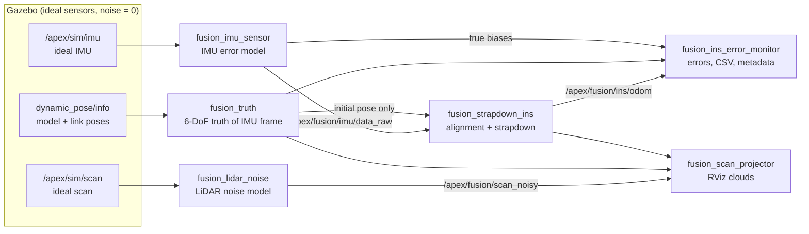

# apex_fusion_research

Sensor models and an unaided inertial navigation baseline for **LiDAR–IMU
sensor-fusion research** on the APEX 1/10-scale car in Gazebo.

The package is the first stage of a research line whose goal is a publishable
LiDAR–IMU fusion method for small autonomous vehicles. It provides:

| Component | What it does |
| --- | --- |
| **LiDAR noise model** | Corrupts Gazebo's ideal scan with a physically motivated, reproducible stochastic model (heteroscedastic range noise, incidence-angle effects, calibration errors, angular jitter, dropouts, short and spurious returns, quantization). |
| **IMU model** | Turns Gazebo's ideal inertial signals into *raw* MEMS measurements (white noise, turn-on bias, Gauss–Markov bias instability, bias random walk, scale factor, misalignment, g-sensitivity, quantization, saturation). No orientation is provided, exactly like a physical 6-axis IMU. |
| **Strapdown INS** | Integrates the raw IMU (attitude, velocity, position) after a realistic static alignment. No aiding: the error accumulation of a real IMU becomes visible. |
| **Ground truth + evaluation** | 6-DoF truth from Gazebo, per-sample navigation errors, CSV/metadata recording and publication-quality plots. |
| **Validation tools** | Allan-variance identification, LiDAR-model statistical report, unit tests with analytical references. |

Every model lives in a ROS-independent module configured by a dataclass. Every
dataclass field is automatically exposed as a ROS parameter, loadable from a
YAML preset and changeable at runtime.

---

## 1. Quick start

```bash
# Conda/venv Pythons break ROS 2 Jazzy; the launcher removes them from the environment.
cd ~/AiAtonomousRc
./simulation/tools/sim/apex_fusion_research_up.sh            # Gazebo GUI + RViz, car idle
./simulation/tools/sim/apex_fusion_research_up.sh --arm      # same, the car drives the autonomous tour
```

What you get:

* **Gazebo** with the car on the track.
* **RViz** (fixed frame `world`) showing, in green, the ground-truth path and the
  noisy scan projected with the true pose and, in orange, the pure-INS path and
  the same scan projected with the INS pose. The orange cloud smears and drifts
  away from the walls as inertial errors accumulate.
* A run directory `simulation/data/fusion_research/<timestamp>/` with the CSV
  of navigation errors, metadata and a copy of the configuration used.

After (or during) a run:

```bash
ros2 run apex_fusion_research plot_ins_drift simulation/data/fusion_research/<run>
```

Useful options of the launcher (`--help` lists all of them):

| Option | Meaning |
| --- | --- |
| `--imu-config <preset\|file.yaml>` | `consumer_mems` (default), `white_noise_only`, `ideal`, or your own YAML |
| `--lidar-config <preset\|file.yaml>` | `rplidar_like` (default), `ideal`, or your own YAML |
| `--ins-config <preset\|file.yaml>` | `static_coarse` (default) or `truth_init` |
| `--imu-seed N`, `--lidar-seed N` | New random realization without editing the YAML (Monte-Carlo runs) |
| `--arm`, `--arm-delay-s S` | Let the car drive; arming happens after the INS alignment |
| `--headless`, `--no-rviz`, `--no-record` | Batch runs |
| `--run-name`, `--output-root` | Where the run is stored |

Equivalent direct launch:

```bash
ros2 launch apex_fusion_research fusion_research_sim.launch.py imu_config:=consumer_mems imu_seed:=3
```

> **Important:** start driving only after the INS log prints
> `navigation started`. The static alignment needs the car to stand still for
> `alignment.duration_s` (5 s by default) and restarts whenever it moves.

---

## 2. Architecture



The vehicle keeps driving with the existing APEX control stack. The research
nodes only observe it, so the experiments never change the vehicle behaviour.
The launch file forces all Gazebo sensor noise to zero, so **every error comes
from the models of this package** and is fully known.

### Package layout

```
apex_fusion_research/
├── apex_fusion_research/
│   ├── core/                  # ROS-independent, unit-tested models
│   │   ├── lidar_noise.py     # LidarNoiseConfig, LidarNoiseModel
│   │   ├── imu_error.py       # ImuErrorConfig, TriadErrorConfig, ImuErrorModel
│   │   ├── strapdown.py       # StrapdownIntegrator, static_coarse_alignment, InsConfig
│   │   ├── allan.py           # overlapping Allan deviation + N/B/K fit
│   │   ├── rotation.py        # quaternion utilities (Hamilton, [w,x,y,z])
│   │   └── config_io.py       # dataclass <-> flat parameters <-> ROS YAML
│   ├── nodes/                 # thin ROS 2 wrappers around core/
│   │   ├── imu_sensor_node.py
│   │   ├── lidar_noise_node.py
│   │   ├── truth_node.py
│   │   ├── strapdown_ins_node.py
│   │   ├── ins_error_monitor_node.py
│   │   ├── scan_projector_node.py
│   │   └── _common.py         # ConfigParameters: dataclass -> ROS parameters
│   └── tools/                 # offline analysis (console scripts)
│       ├── plot_ins_drift.py
│       ├── allan_analysis.py
│       └── lidar_noise_report.py
├── config/{imu,lidar,ins}/*.yaml   # parameter presets
├── launch/fusion_research_sim.launch.py
├── rviz/fusion_research.rviz
└── test/                      # pytest, runs without ROS
```

Design rules:

* **Models are pure NumPy** (`core/`). They can be reused in Monte-Carlo
  scripts, other simulators or a future fusion filter without ROS.
* **Nodes are thin**: they convert messages, call the model and publish.
* **One dataclass per model** is the single source of truth for parameters.
  `ConfigParameters` exposes each field as a ROS parameter
  (`gyro.noise_density`, `alignment.mode`, ...). Changing a parameter at runtime
  rebuilds the model, which for the IMU is equivalent to a power cycle.

---

## 3. LiDAR noise model

`core/lidar_noise.py` corrupts the ideal scan beam by beam. It extends the
beam mixture model of Thrun, Burgard and Fox [1] with a heteroscedastic,
incidence-dependent Gaussian term, systematic calibration errors and angular
jitter, the dominant error sources reported for 2D laser scanners [2, 3].

For beam *i* with nominal azimuth θᵢ and ideal range rᵢ:

1. **Angular jitter.** The beam is fired along θᵢ + δθ, δθ ~ N(0, σ_θ²).
   The true range r\*ᵢ along that direction is interpolated from the ideal scan
   when the neighbouring beams hit the same surface; the published azimuth
   stays θᵢ (encoder error).
2. **Incidence angle** αᵢ between the beam and the surface normal, estimated
   from the neighbouring beams of the ideal scan.
3. **Outcome** (one per beam):
   * **DROPOUT** (published as `+inf`) with probability
     p_drop = p₀ + p_r (r\*/r_max)² + p_graze · 1[α > α_graze]
   * otherwise a mixture of
     * **SHORT** (p_short): unexpected close return, z ~ TruncExp(λ) on [r_min, r\*]
     * **RANDOM** (p_rand): spurious return, z ~ U(r_min, r_max)
     * **HIT** (remaining): z = (1 + s) r\* + b + e,
       e ~ N(0, σ²), σ(r\*, α) = √(σ₀² + (k r\*)²) · (1 + g (1/cos α − 1))

   b ~ N(0, σ_b²) and s ~ N(0, σ_s²) are drawn **once per realization**
   (power-up): range offset and scale calibration errors.
4. **Quantization** to the range resolution and REP-117 conventions
   (`-inf` below `range_min`, `+inf` above `range_max`).

| Parameter | Symbol | Unit | `rplidar_like` |
| --- | --- | --- | --- |
| `range_sigma_const_m` | σ₀ | m | 0.003 |
| `range_sigma_prop` | k | – | 0.005 |
| `incidence_sigma_gain` | g | – | 0.5 |
| `max_incidence_angle_deg` | – | deg | 85 |
| `range_bias_std_m` | σ_b | m | 0.005 |
| `range_scale_std` | σ_s | – | 0.002 |
| `angle_jitter_std_rad` | σ_θ | rad | 0.0035 (0.2°) |
| `dropout_prob_base` | p₀ | – | 0.005 |
| `dropout_prob_range_coeff` | p_r | – | 0.05 |
| `grazing_angle_deg` / `dropout_prob_grazing` | α_graze / p_graze | deg / – | 75 / 0.3 |
| `short_prob`, `short_rate_per_m` | p_short, λ | –, 1/m | 0.002, 1.0 |
| `random_prob` | p_rand | – | 0.001 |
| `range_resolution_m` | – | m | 0.00025 |
| `seed` | – | – | 7 |

The node publishes the empirical outcome fractions and the RMS HIT residual on
`/apex/fusion/lidar/status`, and the realized b, s on the latched topic
`/apex/fusion/lidar/realization`.

---

## 4. IMU error model

`core/imu_error.py` implements the standard inertial sensor error equations
(IEEE Std 952 [4], IEEE Std 1293 [5], Groves [6] §4.4):

```
ω̃ = sat(Q( (I + S_g + M_g) ω + b_g(t) + G_g f + n_g ))
f̃ = sat(Q( (I + S_a + M_a) f + b_a(t)          + n_a ))
```

* ω, f: true angular rate and **specific force** in the sensor frame (Gazebo
  reports +g on z at rest, like a real accelerometer).
* S: diagonal scale-factor errors. M: off-diagonal misalignment and
  non-orthogonality. G_g: gyro g-sensitivity. All three are drawn once per
  realization.
* b(t) = b_on + b_GM(t) + b_RW(t):
  * turn-on bias b_on ~ N(0, σ_on²), constant for one power-up;
  * bias instability as a first-order Gauss–Markov process,
    b_GM[k+1] = e^(−Δt/τ) b_GM[k] + σ_GM √(1 − e^(−2Δt/τ)) w_k;
  * bias random walk (rate / acceleration random walk K),
    b_RW[k+1] = b_RW[k] + K √Δt w_k.
* n: white noise of density N (angle / velocity random walk), per-sample std
  N/√Δt, where Δt comes from the message timestamps.
* Q: quantization to 1 LSB = 2·FS/2^bits. sat: clipping at ±FS.

The model uses four independent random streams (static and dynamic, for gyro
and accelerometer) derived from one seed. Changing gyro parameters therefore
leaves the accelerometer realization untouched. This gives common random
numbers for controlled parameter studies.

| Parameter (`gyro.*` / `accel.*`) | Unit (gyro / accel) | `consumer_mems` gyro | `consumer_mems` accel |
| --- | --- | --- | --- |
| `noise_density` | rad/s/√Hz / m/s²/√Hz | 8.727e-5 (0.005 °/s/√Hz) | 3.923e-3 (400 µg/√Hz) |
| `turn_on_bias_std` | rad/s / m/s² | 8.727e-3 (0.5 °/s) | 0.05 |
| `bias_instability_std` | rad/s / m/s² | 8.727e-5 | 5.0e-4 |
| `bias_correlation_time_s` | s | 100 | 100 |
| `bias_random_walk` | rad/s/√s / m/s²/√s | 1.0e-6 | 1.0e-4 |
| `scale_factor_std` | – | 0.01 | 0.01 |
| `misalignment_std_rad` | rad | 0.007 | 0.007 |
| `g_sensitivity_std` | (rad/s)/(m/s²) | 1.0e-4 | – |
| `full_scale` | rad/s / m/s² | 8.727 (±500 °/s) | 39.227 (±4 g) |
| `adc_bits` | – | 16 | 16 |

White-noise densities are MPU-6050 datasheet values. The other values are
representative of consumer MEMS after basic calibration. **Identify the IMU
that will be mounted on the car with `allan_analysis` and a multi-position
calibration, then write its own preset** before drawing quantitative
conclusions.

Outputs: `/apex/fusion/imu/data_raw` (`sensor_msgs/Imu`, `orientation_covariance[0] = -1`,
white-noise variances on the diagonals), plus the **true** total biases
`/apex/fusion/imu/true_gyro_bias` and `/apex/fusion/imu/true_accel_bias` for
evaluating bias-estimating filters later.

---

## 5. Strapdown INS

`core/strapdown.py` integrates the raw IMU in a local-level, flat,
non-rotating navigation frame (Gazebo world, ENU, g_n = [0, 0, −g]):

```
q_k = q_{k-1} ⊗ Exp(ω̄ Δt)
v_k = v_{k-1} + (R(q_mid) f̄ + g_n) Δt,      q_mid = q_{k-1} ⊗ Exp(ω̄ Δt / 2)
p_k = p_{k-1} + (v_{k-1} + v_k) Δt / 2
```

ω̄ and f̄ are bias-compensated and trapezoidally averaged over the interval
(`integration_scheme: trapezoidal`; `euler` uses the latest sample). Earth rate
and transport rate are neglected, because Gazebo does not simulate them and
the area is a few metres wide.

**Alignment** (`alignment.mode`):

* `static_coarse` (realistic, default): while ground truth confirms the car is
  stationary for `duration_s`, the INS levels itself from the mean specific
  force, estimates the gyro bias as the mean rate and estimates the accelerometer
  bias along gravity from |f̄| − g [6, §5.6]. Horizontal accelerometer bias
  cannot be distinguished from tilt at rest, so it is absorbed into the attitude
  (a fundamental observability limit). Position and heading come from the known
  start pose, since a 6-axis IMU cannot observe heading.
* `truth`: the full initial state is copied from truth and no bias is
  calibrated. This shows the raw effect of every error.

After alignment, ground truth is **never used again**. Expected error growth
for an unaided INS [6, 7]:

| Error source | Position error growth |
| --- | --- |
| Accelerometer white noise (VRW) | ∝ t^1.5 |
| Accelerometer bias b_a | b_a t² / 2 |
| Gyro white noise (ARW), through tilt | ∝ t^2.5 |
| Horizontal gyro bias ε (tilt ε t couples gravity) | g ε t³ / 6 |
| Vertical channel | unstable for any INS (`clamp_vertical_channel` optionally holds it) |

The unit tests check the t² and t³ laws against the integrator.

Service `~/reset` (`std_srvs/Trigger`) restarts the alignment. That's handy for
repeated experiments in one session:
`ros2 service call /fusion_strapdown_ins/reset std_srvs/srv/Trigger`.

---

## 6. Ground truth and evaluation

`fusion_truth` reads `/world/default/dynamic_pose/info`, which runs at about
60 Hz of simulation time. In that stream the model pose is in the world frame
and link poses are relative to the model, so the chassis pose is
T_world_link = T_world_model · T_model_link. The node applies the IMU lever arm
and publishes `/apex/fusion/truth/odom`, containing the pose, the world-frame
velocity from a backward difference, and the body rate.

`fusion_ins_error_monitor` interpolates the truth at every INS timestamp
(linear for position and velocity, SLERP for attitude) and computes position,
velocity and attitude errors. The attitude error is expressed both as Euler
differences and as the rotation vector Log(R_ins R_trueᵀ).

| Topic | Type | Content |
| --- | --- | --- |
| `/apex/fusion/imu/data_raw` | `sensor_msgs/Imu` | raw corrupted IMU |
| `/apex/fusion/imu/true_{gyro,accel}_bias` | `geometry_msgs/Vector3Stamped` | true total biases |
| `/apex/fusion/imu/realization` | `std_msgs/String` (JSON, latched) | config + constant errors drawn |
| `/apex/fusion/scan_noisy` | `sensor_msgs/LaserScan` | corrupted scan |
| `/apex/fusion/lidar/status`, `/realization` | JSON | outcome fractions, residual RMS, b and s |
| `/apex/fusion/truth/odom`, `/path` | `nav_msgs/Odometry`, `Path` | 6-DoF truth of the IMU frame |
| `/apex/fusion/ins/odom`, `/path` | `nav_msgs/Odometry`, `Path` | pure INS solution |
| `/apex/fusion/ins/status`, `/alignment` | JSON | state machine, alignment result (latched) |
| `/apex/fusion/ins/error` | `std_msgs/Float64MultiArray` | t, e_xyz, e_h, e_v, e_rpy (labels in layout) |
| `/apex/fusion/ins/error_summary` | JSON (1 Hz) | INS state and current / maximum errors |
| `/apex/fusion/viz/scan_on_{truth,ins}_pose` | `sensor_msgs/PointCloud2` | scan projected with each pose |

### Recorded run

```
<run_dir>/
├── ins_error.csv       # 20 Hz: truth, INS, errors, true biases, distance travelled
├── metadata.json       # IMU and LiDAR realizations + configs, INS alignment result
├── launch_args.json
├── config/             # exact copies of the YAML presets used
└── ins_drift.png/.pdf  # written by plot_ins_drift
```

---

## 7. Tuning parameters

There are three equivalent ways to change a parameter:

1. **YAML preset.** Copy a file from `config/<kind>/`, edit it, and pass its path:
   `--imu-config ~/my_imu.yaml`. The nested YAML keys map to the dataclass fields.
2. **Launch arguments** for seeds: `--imu-seed 3 --lidar-seed 11`.
3. **At runtime:**
   ```bash
   ros2 param set /fusion_lidar_noise range_sigma_prop 0.01
   ros2 param set /fusion_imu_sensor gyro.noise_density 2.0e-4   # re-creates the IMU (power cycle)
   ros2 param set /fusion_strapdown_ins alignment.mode truth     # resets the INS
   ```
   `rqt_reconfigure` works as well. Invalid values, such as an unknown alignment
   mode, are rejected.

To add a new error term, add a field to the config dataclass, use it in the
model and add a test. The ROS parameter, YAML loading and metadata recording
pick it up automatically.

---

## 8. Analysis and validation tools

```bash
# Error accumulation figure + table at 10/30/60/120 s
ros2 run apex_fusion_research plot_ins_drift <run_dir> [--tmax 120] [--show]

# Allan deviation: validate the IMU model (synthetic) or identify a real IMU (CSV)
ros2 run apex_fusion_research allan_analysis --config consumer_mems --duration 7200
ros2 run apex_fusion_research allan_analysis --csv static.csv --time-col t \
    --gyro-cols gx gy gz --accel-cols ax ay az

# LiDAR model statistics on an analytic room (sigma(r) law, N(0,1) residuals, outcome rates)
ros2 run apex_fusion_research lidar_noise_report --config rplidar_like --scans 2000
```

Unit tests run without ROS:

```bash
cd simulation/ros2_ws/src/apex_fusion_research
/usr/bin/python3 -m pytest -q test
```

They cover rotation algebra, the LiDAR outcome probabilities, the σ(r) law,
incidence estimation on a wall, and reproducibility. For the IMU they cover the
white-noise level, constant errors, independent streams, quantization and
saturation, the Gauss–Markov stationary std, and Allan recovery of N and K. For
the INS they cover a perfect-IMU circle, the b·t²/2 and g·ε·t³/6 laws, and
static alignment.

---

## 9. Reproducibility

* Every stochastic element is seeded (`seed` in each YAML, overridable at
  launch). The same seed and configuration reproduce the same sensor errors.
* Each run stores the exact YAML files, the launch arguments, and the realized
  constant errors (`metadata.json`).
* Timing uses message timestamps (simulation time), not wall-clock time, so
  results do not depend on the real-time factor of the machine.

## 10. Assumptions and limitations

* Gazebo samples the IMU instantaneously at the sensor rate (about 120 Hz, with
  timestamps rounded to the 1 ms physics step). A real IMU low-pass filters and
  decimates internally, so vibration aliasing differs.
* Earth rotation, temperature effects and non-linear scale factor are not modelled.
* The simulated scan is instantaneous, so there is no motion distortion (skew)
  within a revolution yet. That is the next LiDAR model extension, and IMU-based
  de-skewing is a natural fusion contribution.
* Ground truth is limited by Gazebo's pose stream at about 60 Hz. Truth velocity
  is a backward difference.
* Preset values are representative, not identified: see sections 3 and 4.
* The 2D LiDAR is assumed to stay parallel to the ground. Chassis roll and pitch
  are not propagated into the scan geometry.

## 11. Roadmap

1. Identify the real IMU and LiDAR, then create hardware presets.
2. Model LiDAR motion distortion.
3. Loosely coupled error-state Kalman filter: INS prediction plus LiDAR scan
   matching updates, with bias estimation checked against `true_*_bias`.
4. Monte-Carlo campaigns over seeds and parameter sweeps, with NEES/NIS
   consistency and RMSE statistics.

## References

1. S. Thrun, W. Burgard, D. Fox, *Probabilistic Robotics*, MIT Press, 2005 (ch. 6).
2. Slamtec, *RPLIDAR A2 Datasheet*.
3. C. Ye, J. Borenstein, "Characterization of a 2-D Laser Scanner for Mobile Robot Obstacle Negotiation", *Proc. IEEE ICRA*, 2002.
4. *IEEE Std 952-1997*, Specification Format Guide and Test Procedure for Single-Axis Interferometric Fiber Optic Gyros (Annex C: Allan variance).
5. *IEEE Std 1293-2018*, Specification Format Guide and Test Procedure for Linear Single-Axis, Nongyroscopic Accelerometers.
6. P. D. Groves, *Principles of GNSS, Inertial, and Multisensor Integrated Navigation Systems*, 2nd ed., Artech House, 2013.
7. D. H. Titterton, J. L. Weston, *Strapdown Inertial Navigation Technology*, 2nd ed., IET, 2004.
8. N. El-Sheimy, H. Hou, X. Niu, "Analysis and Modeling of Inertial Sensors Using Allan Variance", *IEEE Trans. Instrum. Meas.*, 57(1), 2008.
9. InvenSense, *MPU-6000/MPU-6050 Product Specification*, rev. 3.4.
