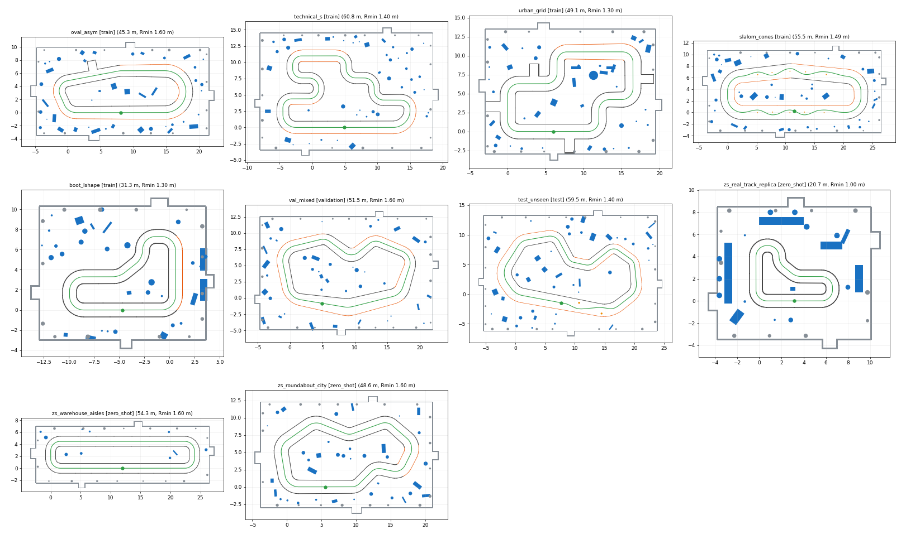

# Multi-scenario LiDAR–IMU pose dataset

Headless Gazebo campaign that produces a supervised dataset for LiDAR–IMU
pose estimation on the APEX 1/10 car. The car drives many tracks, speeds and
motion styles with its normal actuators. Realistic noisy LiDAR and IMU
streams are recorded with their real timestamps, and the exact simulator pose
is stored as the label. Everything goes into one SQLite file ready for PyTorch.



## 1. Quick start

Run from `simulation/`. Relative paths are resolved from `simulation/`, so
the commands also work from any other directory. The script re-executes itself
with the system Python 3.12 and a clean environment, because Conda and the ROS
Gazebo vendor libraries break the gz-sim Python bindings.

```bash
# 1. Maximum stable speed of every track (already done: config/speed_calibration.json)
python3 tools/generate_pose_dataset.py --calibrate-speed

# 2. System check (~10 s): 8 runs, 2 tracks, 2 sensor rates
python3 tools/generate_pose_dataset.py --preset smoke --headless \
  --database data/multiscenario_pose/smoke_pose_dataset.sqlite3

# 3. Plan, time and size estimate of the full campaign
python3 tools/generate_pose_dataset.py --preset full --estimate-only

# 4. Full campaign (resumable: rerun the same command after an interruption)
python3 tools/generate_pose_dataset.py --preset full --headless \
  --database data/multiscenario_pose/pose_dataset.sqlite3 --resume

# Tests (need torch for the loader tests: simulation/learning/.venv)
cd tools && ../learning/.venv/bin/python -m pytest -q pose_dataset/tests
```

Other options: `--workers N` (default: CPU count − 3), `--repeats N` (multiply
every seed list), `--laps X`, `--retry-failed`, `--compress-ranges`,
`--report-only`, `--install-gazebo-worlds` (§12), `--export-worlds DIR`
(writes every world as `world.sdf` plus its metadata to any directory).

Outputs, all ignored by Git (`simulation/data/multiscenario_pose/`):

| Path | Content |
| --- | --- |
| `pose_dataset.sqlite3` | the dataset |
| `pose_dataset_report/` | `campaign_report.json`, `runs.csv` (one row per run), `campaign_distributions.png` |
| `cache/trajectories/` | exact 1 kHz state of every simulated trajectory (`.npz`) for re-synthesis |
| `cache/calibration/` | laps of the speed calibration |
| `full_campaign.log` | progress log of the last full run |

## 2. Why it is fast now, and what was kept

The previous pipeline, the APEX ROS stack plus the Gazebo GUI sensors, ran
at about 0.65× real time. One capture took about 440 s of wall time for one
sensor configuration. The new generator changes how the simulator is driven,
not the physics:

| Change | Effect | Realism |
| --- | --- | --- |
| gz-sim runs **inside the Python process** (`gz.sim8.TestFixture`), headless, no ROS, no transport, `real_time_factor = 0` | 1.6–2.7× real time per process instead of 0.65× | same gz-sim 8 / DART engine, same **1 ms physics step**, same car model |
| **No rendering**: the camera and the GPU LiDAR are removed from the car | no OpenGL work in WSL | the LiDAR is ray-cast exactly against the same SDF geometry (see §5) |
| Controller and actuators run **inside the physics step** | deterministic runs: the same seed gives the same trajectory | same ESC / servo / PID laws as `apex_gz_vehicle_bridge.py` and the URDF plugins |
| **13 isolated worker processes** (own gz partition each) | ~10–15× real time in aggregate | independent simulations |
| One physics run feeds **three sensor profiles** | 3 runs per simulated lap | each profile has its own sampling, noise, mount and timing |
| Wall collisions are checked geometrically instead of by the contact solver | fewer contacts to solve | a touch ends the run as failed, so completed runs never involve wall contact |

Measured on this machine (Core Ultra 7 155H, WSL2, 13 workers), the `full`
preset simulates 2.97 h of driving physics in 14.8 min of wall time, about
12× real time. It produces 7.4 h of sensor streams, three profiles per lap.
That is about 45 times more data per wall-clock hour than the previous
pipeline. Regenerating only the sensors reuses the cached physics.

Every run is deterministic. Two independent executions with the same seed
produced bit-identical ground truth, IMU and LiDAR blobs, and a repeated
speed calibration returned identical limits.

### Dataset produced by the `full` preset

| | train | validation | test |
| --- | --- | --- | --- |
| runs (trajectories) | 390 (150) | 85 (35) | 85 (35) |
| share of runs | 69.6 % | 15.2 % | 15.2 % |
| tracks | 5 training tracks | `val_mixed` + held-out combo on training tracks | `test_unseen` + held-out combo on training tracks |
| sensor-stream hours / km driven | 5.16 h / 37.7 km | 1.13 h / 8.7 km | 1.14 h / 9.9 km |
| LiDAR scans / IMU samples | 261 k / 2.65 M | 54 k / 0.55 M | 59 k / 0.60 M |

The database holds 560 completed runs with 0 failures and 4.16 M ground-truth rows in 2.8 GB.
`PRAGMA integrity_check` returns `ok` with no foreign-key violations. There
are 560 distinct IMU realizations, no trajectory crosses splits, and no
held-out variant is present. The PyTorch loader reads about 2,500–4,000
windows/s with 4 workers.

## 3. Pipeline

```
tracks.yaml ──> tracks.py ──> world geometry (boxes, cylinders) + reference path
                                  │
motion.yaml ─> controller.py ─> speed map v(s) + waypoints (precomputed per seed)
                                  │
vehicle.yaml ─> gz_runner.py: gz-sim in-process, 1 kHz lock-step
                 pure pursuit on the precomputed path, ESC/servo/PID actuators,
                 exact base_link state logged every step ──> cache/trajectories/*.npz
                                  │
sensors.yaml ─> sensors.py: body dynamics, IMU synthesis, rolling LiDAR ray casting,
                 noise models of apex_fusion_research, timestamps ──> qa.py
                                  │
                 campaign.py ──> db.py (SQLite, one transaction per run) ──> report.py
                                  │
                 torch_dataset.py (PoseSequenceDataset + collate_pose_batch)
```

The driver never explores or plans at run time. Each trajectory is a
precomputed path, a seeded lateral offset of the track reference line, plus a
precomputed speed map. A pure-pursuit tracker follows them through the car's
actuators. The path is never teleported. The pose comes from Gazebo's
rigid-body dynamics with tyre friction.

## 4. Vehicle, limits and assumptions

| Quantity | Value | Source |
| --- | --- | --- |
| Chassis | 0.46 × 0.28 × 0.10 m, 4.1 kg total | URDF |
| Wheelbase / track / wheel radius | 0.30 / 0.29 / 0.06 m | URDF, bridge |
| Steering limit | ±18° (right turns reach 96 %) → minimum radius 0.92 m | URDF, bridge |
| ESC | τ = 0.22 s, +1.8 m/s² / −2.4 m/s² | bridge τ, manual-mode limits of `apex_sim.launch.py` |
| ESC throttle cap | 6.0 m/s | **assumption**, never reached, see below |
| Servo | τ = 0.085 s, 70°/s, knuckle PID 28/0.2/0.7, 0.314 N·m | bridge, URDF |
| Friction | µ = 1.2 (wheels and floor) | URDF, worlds |
| Driver | pure pursuit, lookahead max(0.55, 0.35 + 0.32 v) m, 50 Hz | this generator |
| Suspension | roll 3°/g, pitch 2°/g, 3.5 Hz, ζ = 0.45 (±20 % per seed) | **assumption** (Gazebo car is rigid) |
| Vibration | 0.35 m/s² and 0.02 rad/s RMS per m/s, 12–160 Hz, wheel harmonic | **assumption** |

**Maximum stable speed, measured.** `--calibrate-speed` drives one lap per
track at constant target speed, from 1.0 to 6.0 m/s in 0.25 m/s steps, in
both directions. A speed is stable when the lap is completed without
collision, tracking error ≤ 0.25 m, rear-axle slip ≤ 5° and roll/pitch ≤ 10°.
`v_max_stable` is the highest speed with all lower speeds stable in both
directions (`config/speed_calibration.json`):

| Track | v_max_stable | First failure |
| --- | --- | --- |
| oval_asym | 4.75 m/s | tracking error 0.31 m |
| technical_s | 3.50 m/s | tracking error 0.27 m |
| urban_grid | 3.75 m/s | tracking error 0.25 m |
| slalom_cones | 4.75 m/s | cone collisions |
| boot_lshape | 4.25 m/s | rear slip 5.7° |
| val_mixed | 4.75 m/s | tracking error 0.28 m |
| test_unseen | 4.75 m/s | tracking error 0.27 m |
| zs_warehouse_aisles / zs_roundabout_city | 5.00 m/s | tracking error |
| zs_real_track_replica | 2.50 m/s | tracking error |

The 6 m/s throttle cap never limits these values. All motion profiles are
fractions of the track's `v_max_stable`. These speeds are much higher than the
0.24 m/s of the real car's autonomous tour. The real APEX car is driven at
≤ 1.5 m/s manually. The lower speeds appear in the `variable` and
`stop_and_go` profiles, which go down to 30 % and 0 % of v_max, and in the
zero-shot `zs_creep` profile.

## 5. Sensor synthesis

All measurements are computed from the exact 1 kHz state of the trajectory.

**True instants on the physics grid.** Every IMU sample and every scan start
is acquired at a physics step, so its label is the exact simulator state at
that step, with no interpolation and no odometry. The *reported* timestamp
is the true instant plus a constant latency and Gaussian jitter. It is stored
in integer nanoseconds of simulation time and made strictly increasing like a
driver would.

**IMU.**

1. Rigid-body kinematics at the true mount point: f = a + α × r + ω × (ω × r) − g, with g = 9.8 m/s² as in Gazebo.
2. Suspension roll/pitch and their rates.
3. Mount rotation, from the nominal extrinsic plus a seeded miscalibration.
4. Speed-dependent chassis vibration, scaled by the mount gain.
5. The on-chip 2nd-order low-pass (DLPF) with its real group delay.
6. A sample clock with a ppm frequency error. Its instants are rounded to the physics step, so intervals occasionally are 7/9 ms at 125 Hz.
7. The `apex_fusion_research` IMU error model: white noise, turn-on bias plus the configured per-axis bias, Gauss–Markov instability, random walk, scale factor, misalignment, g-sensitivity, ADC quantization and saturation.
8. Isolated and burst dropouts. Missing samples are simply absent.

**LiDAR.**

1. A spinning scanner with per-revolution period jitter.
2. Each beam is fired at its own instant (*rolling scan*) from the laser pose at that instant, including suspension attitude and a seeded extrinsic error. This reproduces the motion distortion of a real 2D LiDAR.
3. Exact 3D ray casting against every box and cylinder of the world, the floor included. A pitched car sees the floor at long range, and low curbs are below the scan plane.
4. The `apex_fusion_research` LiDAR model: heteroscedastic and incidence-dependent range noise, per-power-up bias and scale, angular jitter, missing returns (base + range + grazing), short and random outliers, and quantization.
5. REP-117 values. Whole scans can be lost.

Profiles (`config/sensors.yaml`, every parameter documented there):

| Profile | LiDAR | IMU | Noise |
| --- | --- | --- | --- |
| `A_nominal` | 12 Hz, 360 beams, 360°, 0.15–12 m | 125 Hz, DLPF 44 Hz | RPLIDAR-class, MPU-6050 densities |
| `B_economic` | 10 Hz, 360 beams, 0.15–8 m | 100 Hz, DLPF 20 Hz, 12-bit, ±250°/s, ±2 g | ×2–3 noise, 3 % missing returns, 1 % lost scans, 1 % IMU dropouts, large biases, 1–2 ms stamp jitter |
| `C_fast` | 20 Hz, 360 beams, 0.10–16 m | 200 Hz, DLPF 98 Hz | ICM-42688-class, small but non-zero |

Configurable per profile: LiDAR rate, beams, field of view, minimum/maximum
range, constant and range-proportional range noise, missing-return and outlier
probabilities, timestamp jitter and offset, IMU rate, white noise, per-axis
initial bias, bias random walk, scale error, axis misalignment, saturation,
dropout, and LiDAR/IMU extrinsics with their miscalibration. Seeds: body
dynamics depend on the trajectory key (track, motion, seed, variant), because
all profiles of one lap share the physics. Sensor noise depends on the
trajectory key and the profile. No sensor realization is ever reused on
another lap, so train and test never share biases or noise sequences.

## 6. Tracks, motion profiles and splits

Tracks (`config/tracks.yaml`) are rounded polygons with prescribed radii and
per-edge width. Barriers are tall walls, which block the LiDAR, or low curbs,
over which the LiDAR sees the hall with its columns, niches and doors. Seeded
decoration outside the lane gives identifiable, non-parallel structure.
`boot_lshape` and the zero-shot `zs_real_track_replica` reproduce the topology
of the real track in `docs/reports/Piste.jpeg`: an L shape, a diagonal S-neck
and a U-turn tip.

| Track | Split | Content |
| --- | --- | --- |
| `oval_asym` | train | asymmetric oval, long 180° curve R 3.2 m, straights of different length |
| `technical_s` | train | two hairpins, chains of S-bends, open and tight curves |
| `urban_grid` | train | ~90° corners, streets between tall walls, dead-end alcoves, plaza |
| `slalom_cones` | train | two slaloms with variable cone spacing, ±0.42 m weaving |
| `boot_lshape` | train | real-track-like L shape (×1.5), 1.3 m corridor |
| `val_mixed` | validation only | bean shape, concave section, width 1.5–2.6 m |
| `test_unseen` | test only | decreasing-radius spiral, double apex, pillar chicane, hairpin |

Motion profiles (`config/motion.yaml`): `low` 45 %, `medium` 70 %, `high`
87.5 % of v_max (constant), `variable` (progressive acceleration, hold,
braking, re-acceleration, curvature-limited corners), `stop_and_go` (3–5
full stops per lap, restarts from zero at 1.7 m/s², braking at 2.3 m/s²).
Every run starts with 1.5 s at rest and ends stopped for 1 s.

Splits (`config/campaign.yaml`) are assigned per **trajectory** and per whole
track, so windows of one lap never appear in two splits:

- **train**: the five training tracks. Every speed and sensor profile is included, except the held-out combinations (C_fast, high) and (B_economic, stop_and_go).
- **validation**: the whole `val_mixed` track, plus (B_economic, stop_and_go) on training tracks with dedicated seeds, which gives new laps.
- **test**: the whole `test_unseen` track, plus (C_fast, high) on training tracks with dedicated seeds.

Seeds change the direction (odd seeds counter-clockwise, even seeds
clockwise), start point, lateral offset (±0.10 m, none on the slalom where
the cones dictate the line), driver gains, actuator time
constants, speed map, body dynamics and every noise realization. Held-out
**zero-shot** variants are never written to these databases: see
[ZERO_SHOT.md](ZERO_SHOT.md).

## 7. SQLite database

WAL journal, `foreign_keys=ON`, one transaction per run, indexes on
`(run_id, timestamp_ns)`, final `wal_checkpoint(TRUNCATE)`, `ANALYZE`,
`PRAGMA integrity_check` and `PRAGMA foreign_key_check`. `dataset_meta` stores
the schema version, the role (`main` or `zeroshot`), the configuration hash,
the held-out variant names and this blob format description.

| Table | Content |
| --- | --- |
| `runs` | one row per (trajectory, sensor profile): run_key, trajectory_key, scenario, track, family, split, motion, sensor, seed, direction, simulator_version, git_commit, start/end wall time, simulated_duration_s, start_sim_time_ns, lap_completed, distance_m, v_ref_mps, status (`running`/`completed`/`failed`/`interrupted`), failure_reason, qa_passed, configuration_json |
| `lidar_scans` | scan_id, run_id, seq, timestamp_ns (reported), relative_time_ns, ground_truth_id (first beam), ground_truth_end_id (last beam), angle_min, angle_increment, range_min, range_max, beam_count, time_increment_ns, valid_count, ranges_encoding, ranges_blob, valid_mask_blob |
| `imu_samples` | imu_id, run_id, seq, timestamp_ns (reported), relative_time_ns, ground_truth_id, ax, ay, az [m/s², specific force], gx, gy, gz [rad/s], in the IMU frame |
| `ground_truth` | exact base_link state at the true instant: x, y, z, qx, qy, qz, qw, roll, pitch, yaw, vx, vy, vz (world), vx_body, vy_body, vz_body, wx, wy, wz (body), ax, ay, az (world, no gravity), body_roll, body_pitch (suspension) |
| `sensor_calibration` | per run and sensor: nominal extrinsic translation `[x,y,z]` and rotation `[qx,qy,qz,qw]` (model inputs), nominal frequency, noise configuration JSON, **true** extrinsics and the drawn noise realization (labels) |
| `events` | run_id, timestamp_ns, relative_time_ns, event_type (`static_start`, `drive_start`, `stop_begin`, `stop_end`, `final_brake`, `lap_complete`, `failure`, `run_end`), details_json |
| `imu_bias_truth` | true total accelerometer and gyro bias of every IMU sample (label) |
| `lidar_beam_truth` | true outcome of every beam: hit, missing, short or random outlier (label) |
| `run_qa` | per-run QA checks, metrics and histograms |

**BLOB format** (`blobs.py`, tested):

- `ranges_blob` holds `beam_count` IEEE-754 **float32 little-endian** (`<f4`) values in beam order.
- `ranges_encoding` is `f32le` (raw, default, no compression) or `f32le+zlib` (`--compress-ranges`).
- Values follow REP-117: `+inf` means no return or beyond `range_max`, and `-inf` means closer than `range_min`. NaN is never stored.
- `valid_mask_blob` is `numpy.packbits(valid, bitorder="little")`: bit `i % 8` of byte `i // 8` is beam `i`.

**Frames.** `base_link` sits midway between the axles at wheel-contact
height, with x forward, y left, z up; the world frame is ENU.
`relative_time_ns = timestamp_ns − runs.start_sim_time_ns`. The recording
starts after 0.5 s of physics settling.

**Inputs vs labels.** A model may use `lidar_scans`, `imu_samples`,
timestamps and the *nominal* extrinsics. `ground_truth`, `imu_bias_truth`,
`lidar_beam_truth`, the true extrinsics and the realizations are labels or
evaluation references only.

## 8. Quality control and report

After each run the worker checks:

- strictly increasing timestamps per sensor, with observed rates within 5 % of nominal;
- the IMU samples between consecutive scans;
- NaN and infinite values, and that every measurement has an exact ground-truth row;
- reported minus true timestamp within the configured offset and jitter;
- that the car moved at least 85 % of the planned distance and completed the lap.

Runs failing a check are stored as `failed` with the reason. `report.py`
writes `campaign_report.json` and `runs.csv`, with one row per run. It also
plots histograms of observed frequencies, speeds, accelerations, yaw rates,
initial biases, dropouts, IMU samples per scan interval and the split
distribution.

## 9. PyTorch

```python
import torch
from pose_dataset.torch_dataset import PoseSequenceDataset, collate_pose_batch

ds = PoseSequenceDataset("data/multiscenario_pose/pose_dataset.sqlite3", "train", seq_len=6, stride=3)
loader = torch.utils.data.DataLoader(ds, batch_size=32, shuffle=True, num_workers=4, collate_fn=collate_pose_batch)
batch = next(iter(loader))
batch["scans"]      # (B, 6, 360) ranges, invalid beams filled with 0
batch["scan_valid"] # (B, 6, 360) bool
batch["imu"]        # (B, 5, Lmax, 6) samples between consecutive scans, zero-padded
batch["imu_mask"]   # (B, 5, Lmax) True for real samples; batch["imu_len"] (B, 5)
batch["imu_dt"]     # (B, 5, Lmax) real time since the previous sample [s]
batch["scan_dt"], batch["scan_t_ns"]
batch["gt_delta"]   # (B, 5, 3) exact (dx, dy, dyaw) between scans (label)
batch["gt_pose"]    # (B, 6, 7) exact x, y, z, qx, qy, qz, qw per scan (label)
```

- Windows never cross runs.
- An instance only reads the requested split(s).
- Intervals keep their real length until `collate_pose_batch` pads them.
- Each DataLoader worker opens its own read-only connection.
- An interval can be **empty**. With `B_economic`, an IMU burst dropout can be longer than a LiDAR period. `imu_len` is then 0 and the whole interval is masked, so a model (for example a packed GRU) must handle zero-length intervals, e.g. by clamping the length to 1 over a zero sample.

`tests/test_torch_dataset.py` checks shapes, interval bounds, that masked
statistics and a packed GRU ignore padding, and multi-worker loading.

## 10. Resume, interruption, failures

- Every trajectory runs in its own worker process, with a wall-clock timeout. A crash marks its runs `failed` and the campaign continues.
- A car that collides, leaves the lane, rolls over, gets stuck or times out is stored as `failed` with the reason and its events, without sensor data.
- SIGINT and SIGTERM stop the workers. The current database transaction completes, runs in flight are marked `interrupted`, and the WAL is checkpointed.
- `--resume` skips `completed` runs, redoes `running` and `interrupted` ones, and reuses cached physics.
- `failed` runs are retried only with `--retry-failed`. Physics is deterministic, so a physical failure repeats.

## 11. Known limitations

- The Gazebo car has no suspension. Roll, pitch and vibration come from the documented body model, applied to the sensors. The planar pose, velocities and yaw rate are exact physics.
- The contact model is rigid DART with µ = 1.2, and grip at the limit is probably optimistic. This is why v_max reaches 3.5–4.75 m/s.
- The dimensions of the real-track replica are estimated from a photo.
- The LiDAR sees only boxes and cylinders, with no material reflectivity beyond the statistical dropout model.
- IMU sample instants are rounded to the 1 ms physics step.
- Physics runs at 1 kHz, so the IMU DLPF and sampling cannot represent content above 500 Hz.

## 12. Using the tracks in Gazebo

Every track, including the zero-shot ones, is also installed as a regular
world of `rc_sim_description`, with a matching launcher scenario:

```bash
# (re)generate after editing config/tracks.yaml
python3 tools/generate_pose_dataset.py --install-gazebo-worlds
cd ros2_ws && colcon build --symlink-install --packages-select rc_sim_description && cd ..

./tools/sim/apex_sim_up.sh --scenario pose_oval_asym --rviz          # full APEX ROS stack
gz sim ros2_ws/src/rc_sim_description/worlds/pose_dataset/urban_grid.world   # track only
```

- Worlds are written to `ros2_ws/src/rc_sim_description/worlds/pose_dataset/<track>.world`.
- `tracks_index.json` sits next to them, with the scenario name, spawn pose, role, length and width of each track.
- The worlds contain the dataset geometry with collisions, plus the physics, IMU and rendering-sensor systems the ROS car needs.
- Scenarios `pose_<track>` are appended to `config/apex_sim_scenarios.json`. The existing scenarios are left byte for byte, and they spawn the car at the start of the reference path.

## 13. Files

```
tools/generate_pose_dataset.py          CLI (re-exec into a clean Python 3.12)
tools/pose_dataset/
  config/tracks.yaml motion.yaml sensors.yaml vehicle.yaml campaign.yaml
  config/speed_calibration.json         measured v_max_stable per track
  config/rc_car_model.sdf               car model generated from the xacro (sha1-checked)
  tracks.py geometry.py                 track builder, SDF I/O, footprint collisions
  vehicle.py controller.py gz_runner.py physics, actuators, driver, worker entry point
  raycast.py sensors.py                 LiDAR ray casting and sensor synthesis
  calibrate.py campaign.py parallel.py  speed calibration, campaign, process pool
  db.py blobs.py qa.py report.py        SQLite, BLOB codecs, QA, report
  torch_dataset.py                      PyTorch Dataset + collate
  gazebo_worlds.py                      export to rc_sim_description worlds + scenarios
  tests/                                pytest suite
  ZERO_SHOT.md                          held-out variants
```
